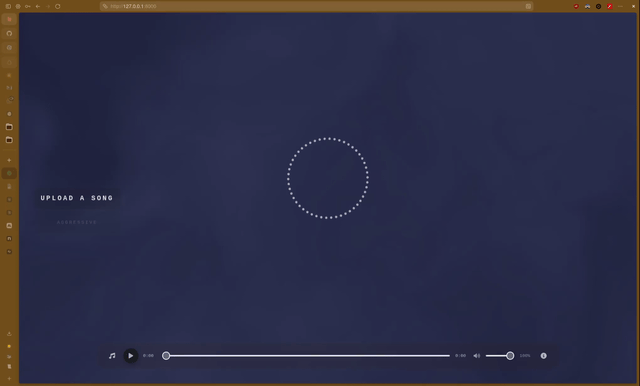

# Music Mood Visualizer

A multimedia pipeline that analyzes an uploaded audio file, classifies its emotional mood using extracted acoustic features, and drives a real-time browser-based visualization synchronized to the music.

---

## Overview

The system accepts a music file from the browser, sends it to a Python backend that extracts audio features and classifies the mood, and maps the result to a distinct color palette and shader background rendered on an HTML5 canvas using p5.js. Audio playback with full transport controls (play/pause, seek, volume) runs in parallel in the browser.

```
User uploads audio file
        │
        ▼
[FastAPI Backend]
   ├── Audio Engine  → Feature Extraction (librosa)
   └── Classifier    → Mood Label (rule-based)
        │
        ▼
[Browser Frontend]
   ├── WebGL Canvas  → Mood-reactive background shader (domain-warped FBM)
   ├── p5.js Canvas  → Real-time radial frequency bar visualization
   └── Web Audio API → Playback with transport controls
```

---

## Demo



---

## Tech Stack

| Layer | Technology |
|-------|-----------|
| Backend language | Python 3.10+ |
| Dependency management | `uv` + `pyproject.toml` |
| Audio analysis | `librosa`, `numpy` |
| API server | `FastAPI`, `uvicorn` |
| Frontend rendering | p5.js (via CDN), raw WebGL |
| Icons | Font Awesome 6 (via CDN) |
| Browser audio | Web Audio API (`AudioContext`, `AnalyserNode`) |

---

## Project Structure

```
music-mood-visualizer/
├── audio/
│   ├── __init__.py          # Public API: exports extract_features
│   ├── __main__.py          # CLI runner: python -m audio <file>
│   └── extractor.py         # Feature extraction using librosa
├── classifier/
│   ├── __init__.py
│   ├── mood_classifier.py   # Rule-based mood classification logic
│   ├── api.py               # FastAPI application with /classify endpoint
│   └── test_classifier.py   # Unit tests for all five mood labels
├── visualizer/
│   ├── index.html           # UI: mood reel, file upload, audio player, info popup
│   ├── background.js        # WebGL background shader (domain-warped FBM per mood)
│   ├── sketch.js            # p5.js canvas + Web Audio API integration
│   └── style.css            # Layout and glassmorphism styling
├── samples/
│   └── Love Takes Miles.mp3 # Sample audio file for testing
├── pyproject.toml           # Project metadata and dependencies
└── README.md
```

---

## Setup and Running

### Prerequisites

- [uv](https://docs.astral.sh/uv/) installed

### Install dependencies

```bash
uv sync
```

### Start the backend

```bash
uv run uvicorn classifier.api:app --reload
```

The API will be available at `http://localhost:8000`.

### Open the frontend

Open `visualizer/index.html` directly in a browser (no build step required). Upload an audio file using the music note icon or press **Ctrl+O** to begin.

---

## API Reference

### `POST /classify`

Accepts an audio file upload, extracts features, and returns the classified mood.

**Request:** `multipart/form-data` with a field named `file` (`.mp3` or `.wav`).

**Response:**

```json
{
  "mood": "euphoric",
  "features": {
    "bpm": 138.5,
    "energy": 0.61,
    "valence": 0.74,
    "danceability": 0.82,
    "spectral_centroid": 3412.0,
    "zero_crossing_rate": 0.08,
    "mode": 1
  }
}
```

### `GET /mock?mood=<label>`

Returns a mock response without processing any audio. Useful for frontend development.

---

## Extracted Features

| Feature | Type | Range | Description |
|---------|------|-------|-------------|
| `bpm` | float | ~40–165 | Tempo in beats per minute (double-time corrected above 165) |
| `energy` | float | 0–1 | RMS loudness, normalized |
| `valence` | float | 0–1 | Spectral brightness proxy (higher = brighter/happier) |
| `danceability` | float | 0–1 | Beat regularity; low = chaotic, high = consistent |
| `spectral_centroid` | float | ~500–8000 Hz | Average timbral sharpness in Hz |
| `zero_crossing_rate` | float | ~0.01–0.15 | Signal noisiness; higher = more chaotic |
| `mode` | int | 0 or 1 | Key tonality: 1 = major, 0 = minor (Krumhansl-Schmuckler profiles) |

---

## Mood Classification

Classification is rule-based, using threshold comparisons on the extracted features. Rules are evaluated in priority order — more specific/restrictive moods are checked first:

| Priority | Mood | Key Conditions |
|----------|------|----------------|
| 1 | `melancholic` | Minor key + very low energy/centroid, or minor + slow + quiet |
| 2 | `calm` | Low energy + clean signal (very low ZCR) |
| 3 | `euphoric` | Bright timbre (centroid ≥ 2500 Hz) + danceable + enough energy |
| 4 | `aggressive` | Fast (BPM ≥ 140) + energy, or loud + very noisy (high ZCR) |
| 5 | `tense` | Minor key with residual energy, or dark timbre at moderate tempo |

Falls back to `calm` if no rule matches.

---

## Visualization

### Background shaders

Each mood triggers a unique full-screen WebGL shader based on domain-warped FBM (fractal Brownian motion), rendered on a dedicated `#bg-canvas` behind the p5 canvas. The default nebula shader plays while no file is loaded or during classification.

| Mood | Shader character |
|------|-----------------|
| `aggressive` | Fast, fiery red-orange turbulence |
| `melancholic` | Slow drifting deep-blue fog |
| `tense` | Amber-purple angular warp |
| `calm` | Gentle teal-green fluid flow |
| `euphoric` | Vivid purple-pink swirling nebula |

### Frequency bars

Radial frequency bars react in real time to the playing audio via the Web Audio API. All moods use the same bar length scale (220 px max), with tinted colors that complement each background:

| Mood | Bar color |
|------|-----------|
| `aggressive` | Warm amber-cream |
| `melancholic` | Pale sky blue |
| `tense` | Pale gold |
| `calm` | Soft mint |
| `euphoric` | Pale lavender |

A dot-ring loading animation plays while the backend processes the uploaded file.

### Mood reel

A vertical slot-machine reel on the left side of the screen shows the current detected mood, with smooth scroll animation and glassmorphism item cards.

---

## UI Controls

| Control | Action |
|---------|--------|
| Click music note icon / **Ctrl+O** | Open file picker to upload a track |
| **Space** | Play / Pause |
| Click progress bar | Seek to position |
| Volume slider | Adjust volume (0–100%) |
| Click ⓘ icon | Show info popup |

---

## Running Tests

```bash
uv run pytest classifier/test_classifier.py -v
```

Tests cover all five mood labels with representative feature vectors including the `mode` field.
